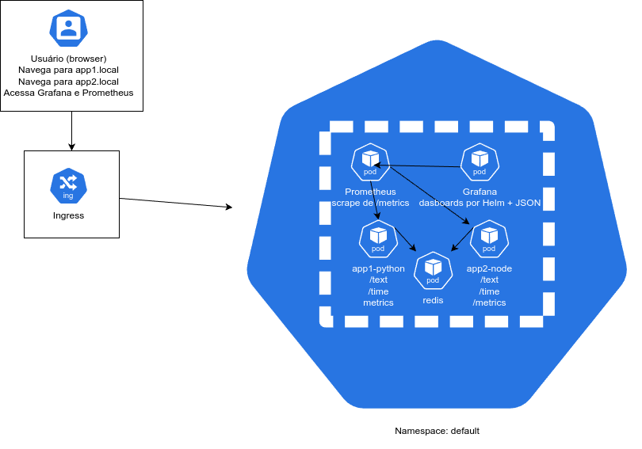

# 🚀 Desafio DevOps 2025

Este repositório contém a solução completa do Desafio DevOps 2025, com duas aplicações (Python e Node.js), monitoramento com Prometheus e Grafana, Redis para cache, além de simulação de carga e automação com shell scripts.

---

## 📦 Estrutura do Projeto

```
DESAFIO-DEVOPS-2025/
├── apps/
│   ├── app1-python/
│   └── app2-node/
├── infra/k8s/
├── diagramas/
│   ├── arquitetura.drawio
│   └── arquitetura.png
├── scripts/
│   ├── start.sh
│   ├── cleanup.sh
│   └── simulate-traffic.sh
└── README.md
```

---

## ⚙️ Tecnologias Utilizadas

- Kubernetes (Minikube)
- Docker
- Prometheus
- Grafana
- Redis
- Python (Flask)
- Node.js (Express)

---

## 🧠 Funcionalidades

- Aplicações com métricas customizadas expostas em `/metrics`
- Cache com Redis (cache hit/miss)
- Dashboards automáticos no Grafana (incluindo métricas customizadas)
- Scripts para setup, teardown e simulação de tráfego

---

## 📌 Arquitetura da Solução



---

## ▶️ Como Executar

1. Clone o repositório:
```bash
git clone https://github.com/seuusuario/desafio-devops-2025.git
cd desafio-devops-2025/scripts
```

2. Execute o script de inicialização:
```bash
chmod +x start.sh
./start.sh
```

3. Acesse os serviços:
```
App1 (Python):    http://app1.local
App2 (Node.js):   http://app2.local
Prometheus:       http://<minikube-ip>:<porta>
Grafana:          http://<minikube-ip>:<porta> (admin/admin)
```

---

## 🌐 Simulação de Tráfego

Execute o script de simulação após o ambiente estar no ar:
```bash
cd scripts
chmod +x simulate-traffic.sh
./simulate-traffic.sh
```

---

## 🧹 Cleanup

Para remover todos os recursos do cluster:
```bash
./cleanup.sh
```

---

## 📝 Observações

- O Ingress utiliza os domínios `app1.local` e `app2.local`, com redirecionamento no `/etc/hosts`
- Os dashboards são carregados automaticamente no Grafana via `ConfigMap`
- O namespace padrão `default` é utilizado por simplicidade

---

## 📸 Dashboards no Grafana

- [x] Request Count por endpoint
- [x] Cache Hit vs Miss
- [x] Latência (p95) via `histogram`

---

## 👨‍💻 Autor

Leandro Santana — DevOps/SRE & Cloud Specialist

---

☁️ Powered by Open Source • Desafio Proposto em 2025

